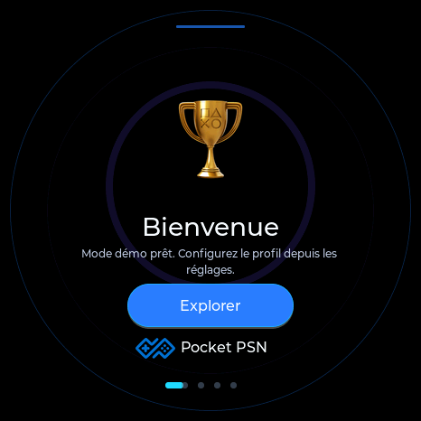
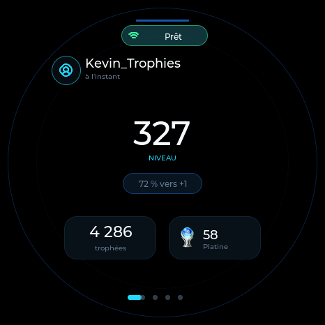
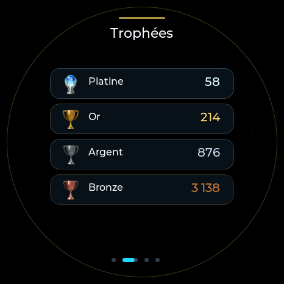
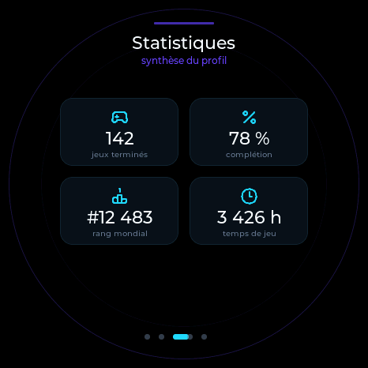

# PlayStation Trophy Display AMOLED

*[English version](README.en.md)*

Un afficheur de bureau qui montre en temps réel vos trophées PlayStation
(niveau, statistiques, derniers gains) sur un écran rond AMOLED, à partir
d'un ESP32-S3 et des données [Pocket PSN](https://pocketpsn.com).

  
  
  
  

Captures du simulateur (donnees de demonstration) -- le rendu sur l'ecran rond reel est identique.

## Installer (le plus simple)

Pas besoin d'installer quoi que ce soit : ouvrez la page d'installation
web depuis **Google Chrome ou Microsoft Edge**, branchez la carte en USB,
et cliquez sur "Installer".

**[→ Page d'installation](https://kevtrs.github.io/PlayStation-Trophy-Display-AMOLED/webinstall/)**

Voir [webinstall/README.md](webinstall/README.md) pour le detail (navigateurs
compatibles, republication d'une nouvelle version).

## Materiel requis

- [Waveshare ESP32-S3-Touch-AMOLED-1.75](https://www.waveshare.com/esp32-s3-touch-amoled-1.75.htm)
  (écran rond 466x466, tactile capacitif CST9217)
- Un câble USB-C (données, pas seulement charge)
- Un compte [Pocket PSN](https://pocketpsn.com) actif (le service qui
  fournit les données de trophées PlayStation)

## Fonctionnalités

- Tableau de bord : niveau PSN, progression, trophées totaux
- Écran "Trophées" : résumé Platine/Or/Argent/Bronze
- Statistiques détaillées (jeux terminés, taux de complétion, temps de jeu...)
- Portail de configuration Wi-Fi intégré (point d'accès `TrophyDisplay-Setup`
  au premier démarrage, aucune application à installer)
- Cache hors ligne : les dernières données restent affichées sans réseau
- Mode démo intégré (aucun compte requis pour tester l'écran)

## Installation classique (PlatformIO)

Pour compiler soi-même ou contribuer au code :

1. Installez [Python](https://www.python.org/downloads/) puis
   [PlatformIO](https://platformio.org/) (`pip install platformio`).
2. Clonez ce dépôt.
3. Lancez `INSTALLER_ET_LANCER.bat` (Windows) — détecte la carte, compile,
   flashe, et ouvre le moniteur série automatiquement.

Voir [PREMIER_DEMARRAGE.md](PREMIER_DEMARRAGE.md) pour la procédure
détaillée et [DEPANNAGE_MATERIEL.md](DEPANNAGE_MATERIEL.md) en cas de
souci matériel.

## Premier démarrage

1. La carte crée son propre réseau Wi-Fi : `TrophyDisplay-Setup`.
2. Connectez-vous à ce réseau, puis ouvrez `http://192.168.4.1/`.
3. Sélectionnez votre réseau Wi-Fi, entrez le mot de passe, renseignez
   votre pseudo PSN, puis cliquez une seule fois sur **Enregistrer**.
4. La carte redémarre et se connecte automatiquement.

## Développement

- `simulator/` : simulateur PC (SDL2) de l'interface, pour itérer sur le
  design sans matériel — voir `simulator/README.md`.
- `tools/` : outils d'investigation du protocole Pocket PSN (usage
  ponctuel, non requis pour utiliser le firmware).
- `AUDIT.md` / `HANDOFF_PROGRESS.md` / `PROJECT_STATUS.md` : journal
  détaillé de toutes les décisions techniques et découvertes faites
  pendant le développement — utile si vous voulez comprendre le "pourquoi"
  d'un choix ou contribuer.

## Crédits

- Données PlayStation fournies par [Pocket PSN](https://pocketpsn.com).
- Projet inspiré du firmware original de
  [tomtechie](https://github.com/tomtechie/Playstation-Trophies-ESP-Display),
  qui a mis en relation avec Pocket PSN pour ce projet.
- Conception et développement : Kevin Torres.

## Licence

[MIT](LICENSE) — voir le fichier `LICENSE` pour le texte complet.
