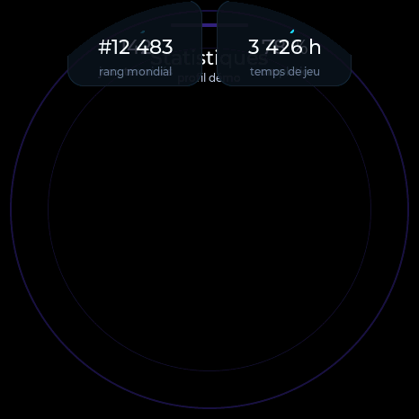
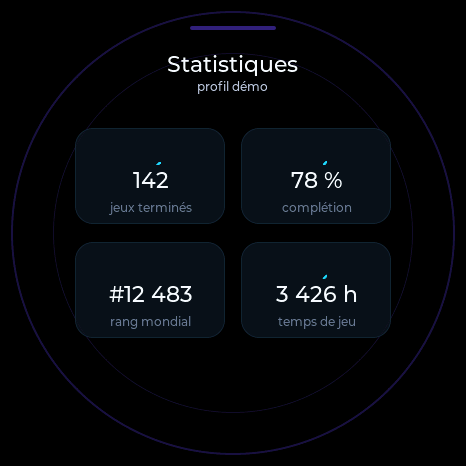
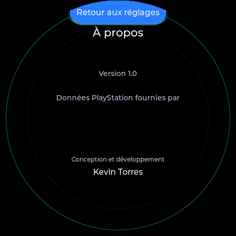

# Resolved issue: `float_in()` settled objects at the wrong position (LVGL 9.4.0)

Status: **fixed**. Root cause confirmed and corrected at the source
(`src/widgets/widgets.cpp`'s `float_in()`), verified against both affected
screens plus a full regression pass. Kept here as a record of the
investigation and the fix, not an open item.

## Symptom (as originally found)

Two screens were affected:

- **Statistics** (`build_statistics_screen()`): the two stat tiles that
  should sit at `STAT_CARD_BOTTOM_Y` (rang mondial / temps de jeu) rendered
  near the top instead, overlapping the page title; the two tiles at
  `STAT_CARD_TOP_Y` (jeux terminés / complétion) didn't render at all.
- **About** (`build_about_screen()`): the "Pocket PSN" provider label, the
  "pocketpsn.com" link button and the "Retour aux réglages" button all
  rendered bunched near the top of the screen instead of their coded
  positions; "Trophy Display"/"Version 1.0" and the `provider`/`link`
  labels were missing from view entirely.

| Screen | Before the fix | After the fix |
|---|---|---|
| Statistics |  |  |
| About |  |  |

## Root cause

`float_in()` (`src/widgets/widgets.cpp`) reads the object's *current*
position to compute its entrance animation:

```cpp
void float_in(lv_obj_t *obj, int delay, int dy) {
    const lv_coord_t y = lv_obj_get_y(obj);   // <-- read here
    lv_obj_set_y(obj, y + dy);
    ...
    lv_anim_set_values(&a, y + dy, y);        // animates back to `y`
    ...
}
```

Immediately after an object is created and positioned with
`lv_obj_set_pos()`/`lv_obj_align()` (as `make_stat_tile()`, `make_label()`,
etc. do), LVGL 9.4 has **not yet run a layout pass** — `lv_obj_get_y(obj)`
at that point can return a stale value (observed: `0`) instead of the
coordinate that was just set. `float_in()` was calling this *before* any
such layout pass, baking the wrong `y` into its animation and settling the
object at the wrong final position (or leaving it effectively invisible,
depending on the specific offset).

Confirmed directly: calling `lv_obj_update_layout(root)` right after
creating an object and reading `lv_obj_get_x/y` immediately after reports
`(0,0)`; calling it again after an explicit `lv_obj_update_layout(root)`
reports the correct value (e.g. `(75,242)`).

Statistics and About were the two screens where this manifested visibly.
It did **not** explain itself why Dashboard/Trophies (which also call
`float_in()` on freshly-positioned objects: `total_card`/`plat_card`,
`r1`..`r4`) rendered correctly regardless — that part was never fully
understood, and wasn't required to be, once the fix was applied at the
actual read site rather than guessed at per-screen.

## Fix

One line added to `float_in()` itself, not to any individual screen:

```cpp
void float_in(lv_obj_t *obj, int delay, int dy) {
    lv_obj_update_layout(obj);   // resolve real coordinates before reading them
    const lv_coord_t y = lv_obj_get_y(obj);
    ...
```

`lv_obj_update_layout(obj)` always resolves the *entire* screen containing
`obj` (confirmed in LVGL's own source: it looks up the screen via
`lv_obj_get_screen()` internally regardless of which object is passed), so
this one call is sufficient no matter which object calls it from. Fixing
the shared helper at its root avoids repeating an `lv_obj_update_layout()`
call (and its justification) in every affected screen builder, and
protects every other screen using `float_in()` the same way (Boot,
Welcome, Dashboard, Trophies, Celebration) against the same latent risk,
not just the two that happened to show it.

No visual/design change: same final position, same animation curve and
duration, just computed from a correct starting value instead of a stale
one.

## Verification

- 193/193 `--selftest` passes.
- Full interactive run: all 8 product screens (Dashboard, Trophies,
  Statistics, Sync, Offline, Error, Settings, About) captured and visually
  confirmed correct, including the two previously-broken ones.
- Boot B1's own real-progression check (`verifyBootSequence()`) still
  passes — Boot also uses `float_in()` (icon, title) and was unaffected
  either way, confirmed still fine after the fix.
- Full navigation cycle (forward + backward swipe through all 6 pages)
  and the 5-cycle memory-stability check both still pass.
- Firmware builds clean (RAM 15.3%, Flash 50.6%, unchanged).
