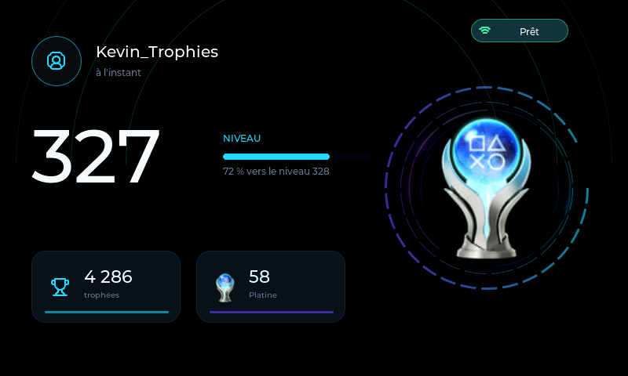
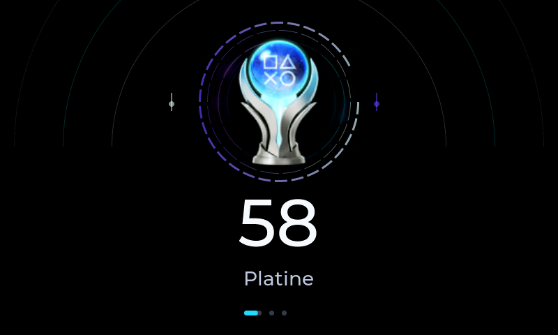
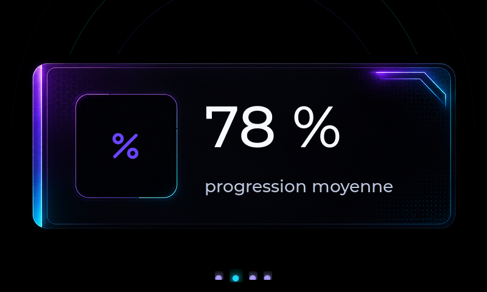

# PlayStation Trophy Display -- trophy display (7" touchscreen)

> Ready-to-paste text for the MakerWorld page description.
> Print settings extracted from the provided Bambu Studio project
> (`PocketPSN Trophy.3mf`). Exact print time and filament weight depend
> on your slicer -- not included in the project file (never sliced).

## Hook

The large-format version of the PlayStation trophy display: a 7-inch
touchscreen that shows your level, trophies and stats in real time --
sitting on your desk, a shelf, or next to your gaming setup.

## What it is

This project combines a 3D-printed enclosure with a small computer (an
ESP32-S3 board with a built-in 800x480 touchscreen) that connects to
your PlayStation account through [Pocket PSN](https://pocketpsn.com) to
automatically cycle through:

- A dashboard: PSN level, progress, total trophies
- A Trophies screen: Platinum / Gold / Silver / Bronze summary
- A Statistics screen: games completed, completion rate, playtime,
  world rank
- Data stays on screen even without a connection (offline cache)

No app to install on your PC or phone: everything is set up directly
on the screen, over Wi-Fi.

## Screenshots

> Generated from the simulator (demo data) -- the real screen looks
> identical. Upload these as images on the MakerWorld page (the
> Markdown link below won't render as-is on MakerWorld, it's just a
> reference).

| Dashboard | Trophies | Statistics |
|---|---|---|
|  |  |  |

## What you need

- A [Waveshare ESP32-S3-Touch-LCD-7](https://www.waveshare.com/esp32-s3-touch-lcd-7.htm)
  board (800x480 touchscreen, GT911) -- not included, buy separately
- A USB-C cable (data-capable, not charge-only)
- An active [Pocket PSN](https://pocketpsn.com) account (free
  third-party service that provides PlayStation trophy data)
- PLA filament (a single color is enough for this stand)
- 2 screws (exact size depends on your inserts/tapping -- 2 mounting
  posts are built into the stand)

## 3D printing

The stand is **a single part**: an open tray the Waveshare board sits
in and screws down to (the screen module already has its own bezel, so
there's no separate front cover).

- Printer used for the design: Bambu Lab X1 Carbon (0.4 mm nozzle)
- Material: PLA, single color
- Profile: "0.28mm Extra Draft" (fast print)
- Layer height: 0.28 mm (first layer 0.2 mm)
- Wall loops: 2
- Infill: 5%
- Supports: yes (tree, automatic)
- Print time and filament weight: depend on your slicer/printer -- not
  included with the 3D project

## Assembly

1. Print the stand (see settings above).
2. Place the Waveshare board into the stand, aligned with the mounting
   posts.
3. Secure with the 2 screws.
4. Route the USB-C cable through the provided opening.

## Installing the firmware (no technical skills required)

1. Open **Google Chrome** or **Microsoft Edge** (required -- other
   browsers won't work for this step).
2. Plug the board into your computer via USB-C -- **use the port
   labeled "UART"**, not the "USB" port (they look similar, only UART
   works for installation).
3. Go to the install page:
   **https://kevtrs.github.io/PlayStation-Trophy-Display-AMOLED/webinstall_7inch/**
4. Click **Install** and follow the on-screen instructions.
5. Once installation is complete, unplug and replug the board.

No software to download, no command line.

## First-time setup

1. The board creates its own Wi-Fi network: `TrophyDisplay-Setup`.
2. Connect to that network from your phone or computer, then open
   `http://192.168.4.1/` in a browser.
3. Select your home Wi-Fi network (or type its name manually if the
   scan doesn't find it), enter its password, enter your PSN username,
   then click **Save** once.
4. The board restarts and connects automatically. Your trophies show
   up within seconds and cycle automatically between screens.

## Source code

The full firmware is open source:
**https://github.com/Kevtrs/PlayStation-Trophy-Display-AMOLED**

## Credits

- PlayStation data provided by [Pocket PSN](https://pocketpsn.com).
- Design and development: Kevin Torres.

## License

Firmware under the MIT license. [3D MODEL LICENSE -- specify on the
MakerWorld page itself, e.g. CC BY-NC-SA 4.0]
